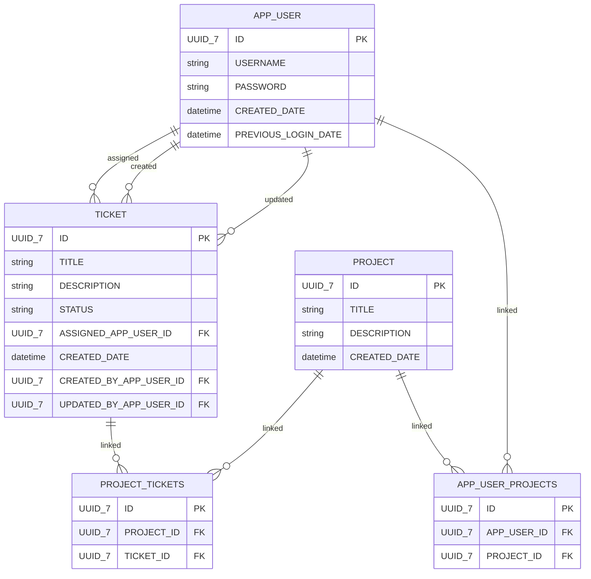

### 

```mermaid
erDiagram
    APP_USER {
        UUID_7 ID PK
        string USERNAME
        string PASSWORD
        datetime CREATED_DATE
        datetime PREVIOUS_LOGIN_DATE
    }

    TICKET {
        UUID_7 ID PK
        string TITLE
        string DESCRIPTION
        string STATUS
        UUID_7 ASSIGNED_APP_USER_ID FK
        datetime CREATED_DATE
        UUID_7 CREATED_BY_APP_USER_ID FK
        UUID_7 UPDATED_BY_APP_USER_ID FK
    }

    PROJECT {
        UUID_7 ID PK
        string TITLE
        string DESCRIPTION
        datetime CREATED_DATE
    }

    PROJECT_TICKETS {
        UUID_7 ID PK
        UUID_7 PROJECT_ID FK
        UUID_7 TICKET_ID FK
    }

    APP_USER_PROJECTS {
        UUID_7 ID PK
        UUID_7 APP_USER_ID FK
        UUID_7 PROJECT_ID FK
    }

    %% Relationships
    APP_USER ||--o{ TICKET : "assigned"
    APP_USER ||--o{ TICKET : "created"
    APP_USER ||--o{ TICKET : "updated"

    PROJECT ||--o{ PROJECT_TICKETS : "linked"
    TICKET ||--o{ PROJECT_TICKETS : "linked"

    APP_USER ||--o{ APP_USER_PROJECTS : "linked"
    PROJECT ||--o{ APP_USER_PROJECTS : "linked"

```
