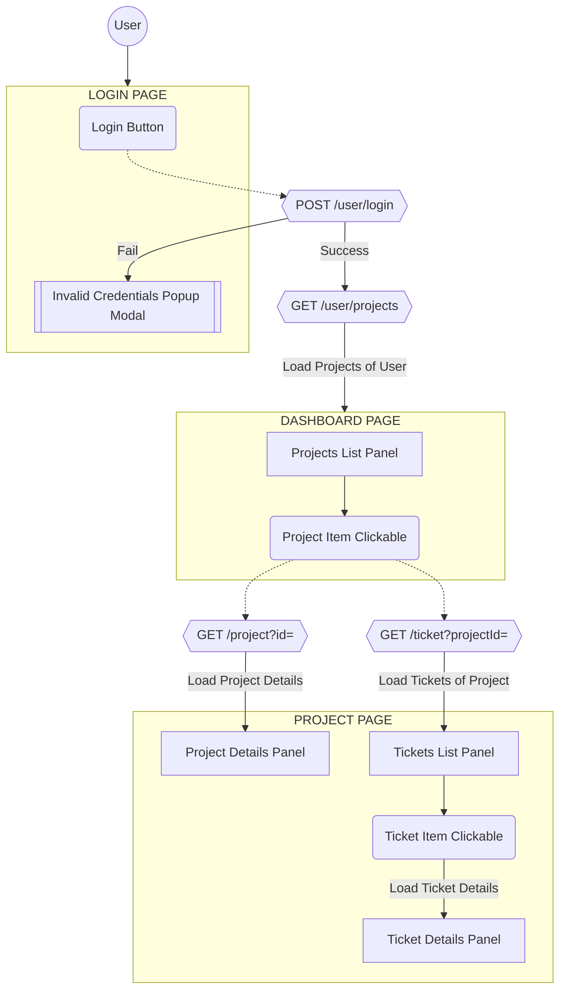

### 

```mermaid
flowchart TD
    %% User
    user((User))

    %% Frontend UI
    subgraph LoginPage [LOGIN PAGE]
        loginButton(Login Button)
        invalidCredsModal[["Invalid Credentials" Popup Modal]]
    end

    subgraph DashboardPage [DASHBOARD PAGE]
        projectsListPanel[Projects List Panel]
        projectClickableItemUrl(Project Item Clickable)
    end

    subgraph ProjectPage [PROJECT PAGE]
        projectDetailsPanel[Project Details Panel]
        ticketsListPanel[Tickets List Panel]
        ticketClickableItemUrl(Ticket Item Clickable)
        ticketDetailsPanel[Ticket Details Panel]
    end

    %% Backend APIs
    postUserLogin{{POST /user/login}}
    getProjectsOfUser{{GET /user/projects}}
    getProject{{GET /project?id=}}
    getTicketsByProject{{GET /ticket?projectId=}}

    %% Flows
    user --> LoginPage
    loginButton -.-> postUserLogin

    postUserLogin -- Fail --> invalidCredsModal
    postUserLogin -- Success --> getProjectsOfUser -- Load Projects of User --> DashboardPage 

    projectsListPanel --> projectClickableItemUrl

    projectClickableItemUrl -.-> getProject -- Load Project Details --> projectDetailsPanel
    projectClickableItemUrl -.-> getTicketsByProject -- Load Tickets of Project --> ticketsListPanel

    ticketsListPanel --> ticketClickableItemUrl
    ticketClickableItemUrl -- Load Ticket Details --> ticketDetailsPanel


```
