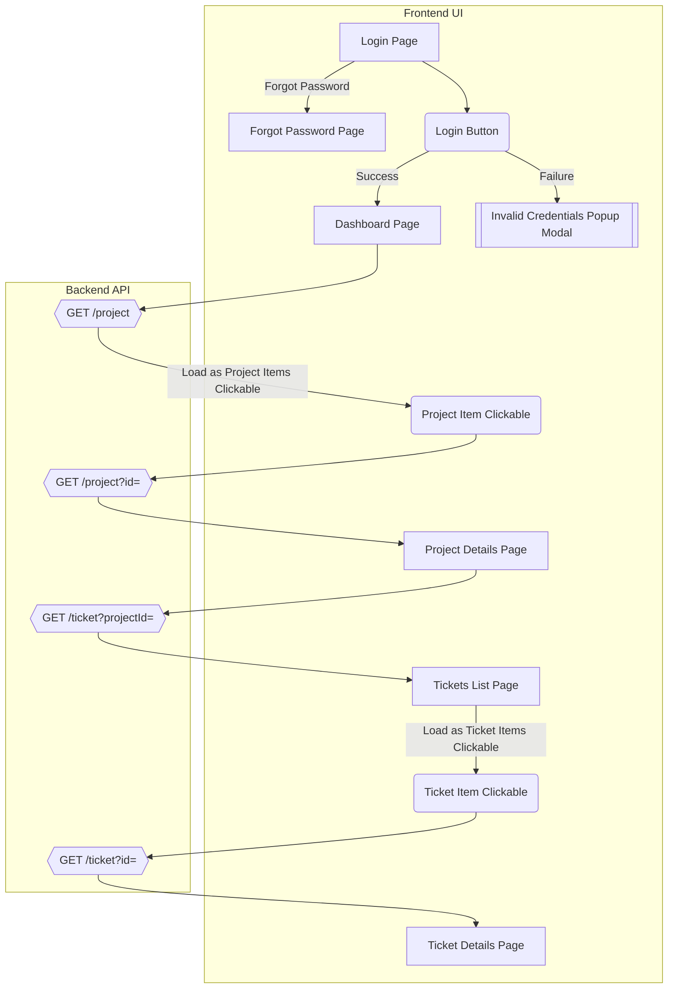

### 

```mermaid
flowchart TD
    %% Frontend UI
    subgraph Frontend [Frontend UI]
        loginPage[Login Page]
        dashboardPage[Dashboard Page]
        projectDetails[Project Details Page]
        ticketDetails[Ticket Details Page]
        ticketsPage[Tickets List Page]
        forgotPassword[Forgot Password Page]

        loginButton(Login Button)
        projectClickableItemUrl(Project Item Clickable)
        ticketClickableItemUrl(Ticket Item Clickable)

        invalidCredsModal[["Invalid Credentials" Popup Modal]]
    end

    %% Backend APIs
    subgraph Backend [Backend API]
        getProjects{{GET /project}}
        getProject{{GET /project?id=}}
        getTicketsByProject{{GET /ticket?projectId=}}
        getTicket{{GET /ticket?id=}}
    end

    %% Flows
    loginPage --> loginButton
    loginButton -- Success --> dashboardPage
    loginButton -- Failure --> invalidCredsModal
    loginPage -- Forgot Password --> forgotPassword

    dashboardPage --> getProjects
    getProjects -- Load as Project Items Clickable --> projectClickableItemUrl
    projectClickableItemUrl --> getProject
    getProject --> projectDetails --> getTicketsByProject --> ticketsPage
    ticketsPage -- Load as Ticket Items Clickable --> ticketClickableItemUrl
    ticketClickableItemUrl --> getTicket --> ticketDetails

```
