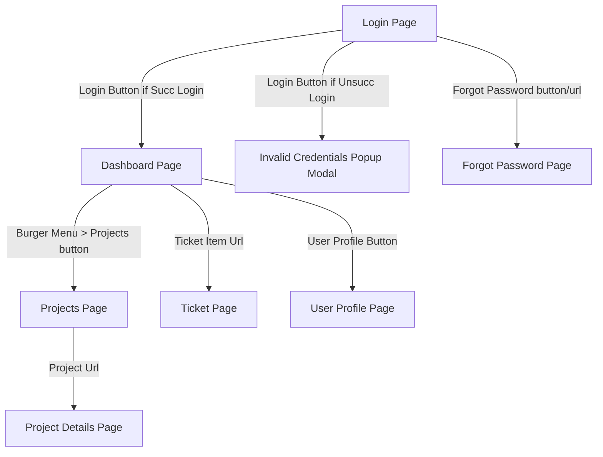

### 

```mermaid
flowchart TD
    A[Login Page] -- Login Button if Succ Login ---> B[Dashboard Page]
    A[Login Page] -- Login Button if Unsucc Login ---> J["Invalid Credentials" Popup Modal]
    B[Dashboard Page] -- Burger Menu > Projects button ---> C[Projects Page]
    C[Projects Page] -- Project Url ---> D[Project Details Page]
    B[Dashboard Page] -- Ticket Item Url ---> E[Ticket Page]
    B[Dashboard Page] -- User Profile Button ---> H[User Profile Page]
    A[Login Page] -- Forgot Password button/url ---> I[Forgot Password Page]
```
